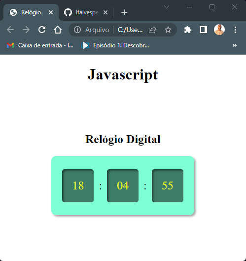

# Estudos Javascript

Repositório de estudos em Javascript.

- <a href="https://lfalvespe.github.io/estudos-javascript/metodos-arrays/">Métodos de Arrays</a>
<-- Clique Para acessar.
  

- <a href="https://lfalvespe.github.io/estudos-javascript/cronometro/">Cronômetro</a>
<-- Clique Para acessar.

  
 
- <a href="https://lfalvespe.github.io/estudos-javascript/relogio/">Relógio Digital</a>
<-- Clique Para acessar.
  
